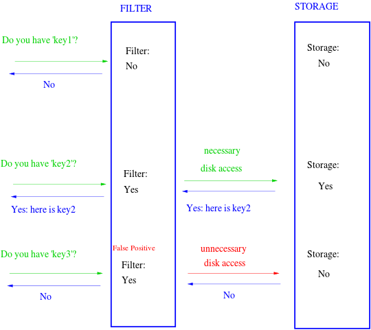

# bloom-filter

> "A Bloom filter is a data structure designed to tell you, rapidly and memory-efficiently, whether an element is
> present in a set."

- "it tells us that the element either definitely is not in the set or may be in the set."

## Funktionsweise



Mit `h(n) = n mod m`:

- `n`: Key
- `m`: Length of Filter

1. Element `n` mit Hashfunktion hashen
2. `h(n) = 0` -> Element nicht vorhanden
3. `h(n) = 1` -> Element "möglicherweise" vorhanden, da auch eine anderes Element an der Stelle sein könnte

## Beispielhafter pseudocode

```
function bloomFilter(ortsname) {

  int filterLength = 10
  int filter = array[filterLength]

  // h(n) -> Hash function
  int position = h(ortsname) % filterLength

  if(filter[position] == 0) return false // Not there
  return true // Probably there
}
```


## Quellen

- <https://youtu.be/gBygn3cVP80>
- <https://de.wikipedia.org/wiki/Bloomfilter>
- <https://en.wikipedia.org/wiki/Bloom_filter>
- Interactive tutorial: <https://llimllib.github.io/bloomfilter-tutorial/>
