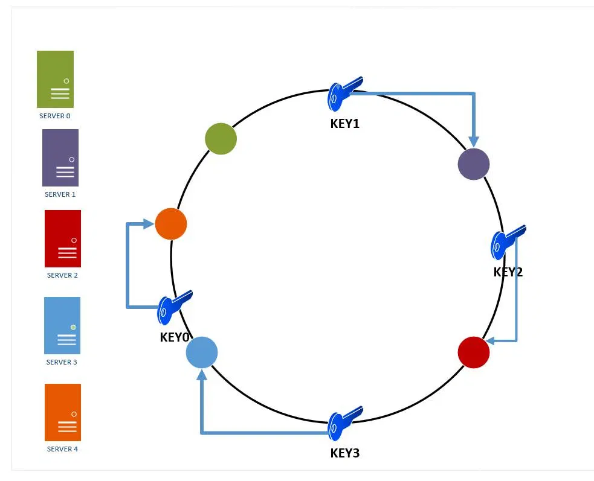

# consistent-hashing

> Problem: Wie finde ich den Speicherort für ein Objekt in einem verteilten System mit n Knoten?

1. Knoten werden in Adressraum/Hashtabelle (0..S) angeordnet (z.B. durch Hashen der IP)
2. Objekte werden mit der gleichen Hashfunktion gehashed
3. Der Zuständige Knoten ist der mit dem nächsthöheren Hashwert (im Uhrzeigersinn der nächste)
4. Knoten werden mehrfach „virtualisiert“ im Ring angeordnet (z.B durch Hash („IP1-1“), Hash („IP1-2“), …)
5. Anzahl der virtuellen Punkte pro Knoten kann auch anhand der Leistungsstärke variiert werden
6. Anordnung kann auch anhand von „Partitionen“ erfolgen

## Vorteile

- Gleichmäßige Verteilung der Last wenn sich die Anzahl der Knoten ändert
- Dynamische Anpassung der Last durch die Anzahl „virtueller Punkte“ möglich => langsames Anfahren
- Redundanz / Replikation durch weitere Schreib Vorgänge beim „nächsten“, „übernächsten“ etc. Knoten.
- Dadurch auch bereits „gefüllter Cache“ möglich

## Unterschied Replicas und Virtuelle Knoten

1. Virtuelle Knoten sind Referenzen zu den physikalischen Knoten und enthalten keine Daten direkt
2. Replicas fungieren als "Backup" und enthalten eine Kopie der Daten

- <https://stackoverflow.com/questions/40622492/difference-between-replicas-and-virtual-nodes-in-consistent-hashing>

## Sources

- Image: <https://i0.wp.com/www.acodersjourney.com/wp-content/uploads/2017/08/Consistent-Hashing-Adding-Servers.jpg>
- <https://en.wikipedia.org/wiki/Consistent_hashing>
- Discord uses consistent hashing 🤔: <https://blog.discord.com/scaling-elixir-f9b8e1e7c29b>
- Good resources:
  - <https://www.toptal.com/big-data/consistent-hashing>
  - <https://itnext.io/introducing-consistent-hashing-9a289769052e>
