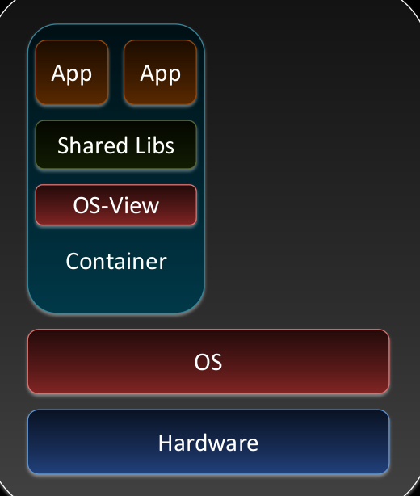

# container-virtualisierung

> Wie [[applikations-virtualisierung]] aber stärkere Isolierung der Container

1. **Namespace Isolation**: Prozess Ids, User Ids, Netzwerk Karten, Mounts, Interprozess Kommunikation, etc.
2. **Ressource Management für CPU, RAM, I/O**: Limitierung, Priorisierung, Accounting

- Viele Instanzen gleichartiger Systeme
- Technologien: LXC, OpenVZ (Linux Containers) Cgroups, Docker

[//begin]: # "Autogenerated link references for markdown compatibility"
[applikations-virtualisierung]: applikations-virtualisierung.md "applikations-virtualisierung"
[//end]: # "Autogenerated link references"
