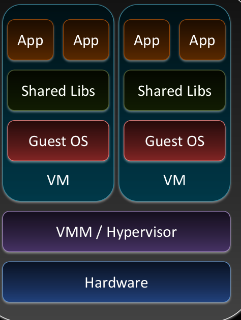
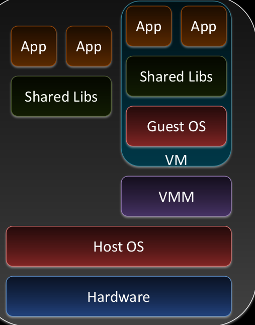

# hardware-virtualisierung

Arten der Hardware Virtualisierung:

- HW-[[emulation]]
- [[vollvirtualisierung]]
- [[paravirtualisierung]]
- Virtualisierungstechniken werden oft gemischt z.B. HW Virtualisierung mit Paravirtualisierten Treibern

## Virtual Machine Monitor (VMM)/ Hypervisor

> Abstraktion der HW & Verwaltung der VMs

Position des VMM:

### Bare Metal

> VMM / Hypervisor verwaltet die HW direkt – kein weiteres

| Vorteile                                           | Nachteile                                                                                              |
| -------------------------------------------------- | ------------------------------------------------------------------------------------------------------ |
| Bessere I/O Leistung                               | Benötigt eigenen Treiber für alle HW Komponenten die den VMs angeboten werden => limitierte HW Auswahl |
| Mögliche Unterstützung für Echtzeit Betriebsysteme | Installationsaufwand                                                                                   |

Beispiele:

- VM-Ware ESXi, MS Hyper-V

### Hosted

> VMM / Hypervisor läuft auf Basis von Host Betriebsystem

- Benutzt Treiber des HOST OS

Beispiele:

- Virtual Box, VMware Workstation, Virtual PC (ab Win 7 )

[//begin]: # "Autogenerated link references for markdown compatibility"
[emulation]: emulation.md "emulation"
[vollvirtualisierung]: vollvirtualisierung.md "vollvirtualisierung"
[paravirtualisierung]: paravirtualisierung.md "paravirtualisierung"
[//end]: # "Autogenerated link references"
