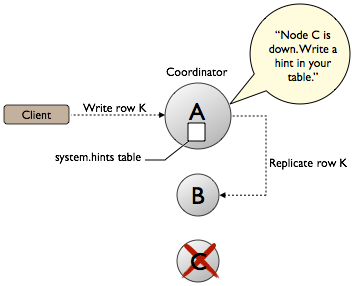

# hinted-handoff

> "Hinted handoff is a Cassandra feature that optimizes the cluster consistency process and anti-entropy when a
> replica-owning node is not available, due to network issues or other problems, to accept a replica from a successful
> write operation." [^hha]

[^hha]: https://docs.datastax.com/en/cassandra-oss/2.1/cassandra/dml/dml_about_hh_c.html
