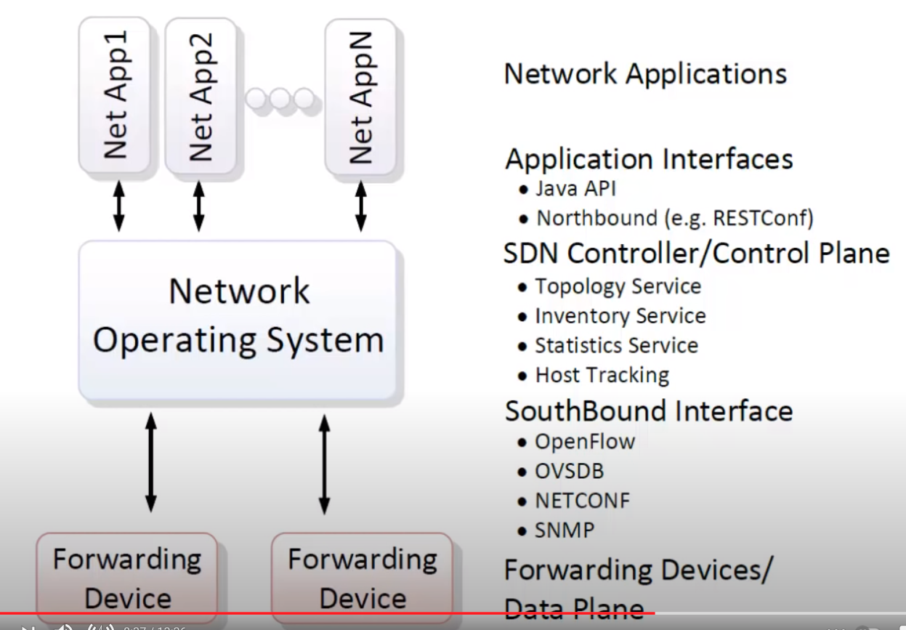

# network-scaling

## Netzwerkvirtualisierung

- Von Netzwerkvirtualisierung klassisches Datacenter mit VLANs -> Cloud Datacenter für viele Mandanten ->
  Vielbenutzerbetrieb über mehrere Datacenter

## Software Defined Networks (SDN)

> Good intro Video: <https://www.youtube.com/watch?v=DiChnu_PAzA>

- Nutzt 3 Schichten Modell:
  1. Forwarding device
  2. Network OS
  3. Network application
- Die Availability von Netzwerk BS kann durch Clustern verbessert werden

### Eigenschaften SDNs

- Scale-Out durch
  - Verschieben der Netzwerkvirtualisierung in L3 Soft-Switches
  - Nutzung von
    - L3 Dynamik: OSPF, BGP, Netconf, MP-BGP
    - L2 Tunneln o.ä.: MPLS, NVGRE, VXLAN, L2/L3 VPN, SPB, TRILL, LISP, STT
    - Offenen Plattformen auf Netzwerkelementen, z.B. Cumulus
- protokollbasierte Kontrolle der Netzwerkkomponenten im Transport
- Orchestrierung der Dienstleistungen (z.B. per XMPP)
- Dadurch
  - Mehrmandantenfähigkeit
  - Entkopplung des physikalischen Netzes
    - Von der logischen Sicht
    - Von Netzwerkelement-Migration und Lastverteilung
    - In Bezug auf die Bedeutung von Fehlern: Isolation!
  - Fortschreitende Standardisierung Einführung

### SDN Prinzipien

1. Abstraktion

   - Kleine Menge von Zugriffsmethoden
   - Protokoll-unabhängig, in Hardware gemacht
   - Policy unabhängig

2. Offene APIs und Programmierbarkeit

   - Forwarding / Kontrolle entkoppelt, OpenFlow
   - Neue Features leicht einzuführen

3. Globale Netzwerksicht

   - Provisionierung vereinfacht
   - Problemlösungen beschleunigt
   - Virtualisierte Netzwerksicht Einführung

## OpenFlow

> Zentrales SDN Protokoll der Open Networking Foundation

- Open Hardware & Software

## P4 als DSL für Packet Processing

> Packet Processing Domain Specific Language

- Nutzt Netzwerkelemente aller Art
- Protokollunabhängig
- C-Style
