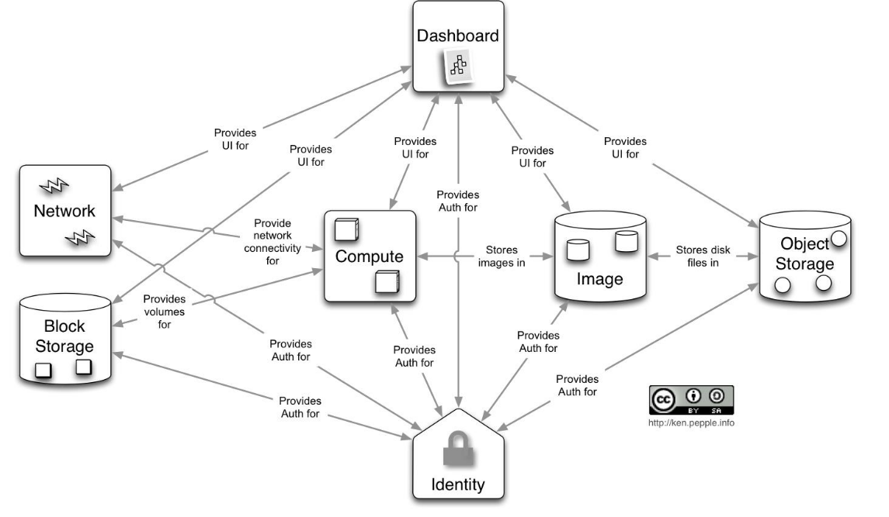

# opensstack

> Softwareprojekt, das eine freie Architektur für Cloud-​Computing zur Verfügung stellt.

Komponenten:

1. Openstack Compute: Nova
   - Unterstützt zahlreiche Hypervisoren
   - EC2-API Kompatibel
2. Openstack Storage:
   - Swift:
     - Eventual consistent
     - RESTful API
   - Cinder: Block Storage
   - Glance: VM Image Storage
3. Weitere:
   - Neutron(Quantum): Netzwerkmodell
   - Keystone: Identity, Authentication, Authorization,...
