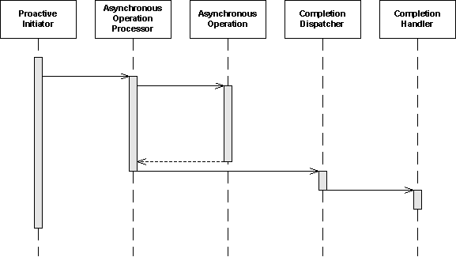
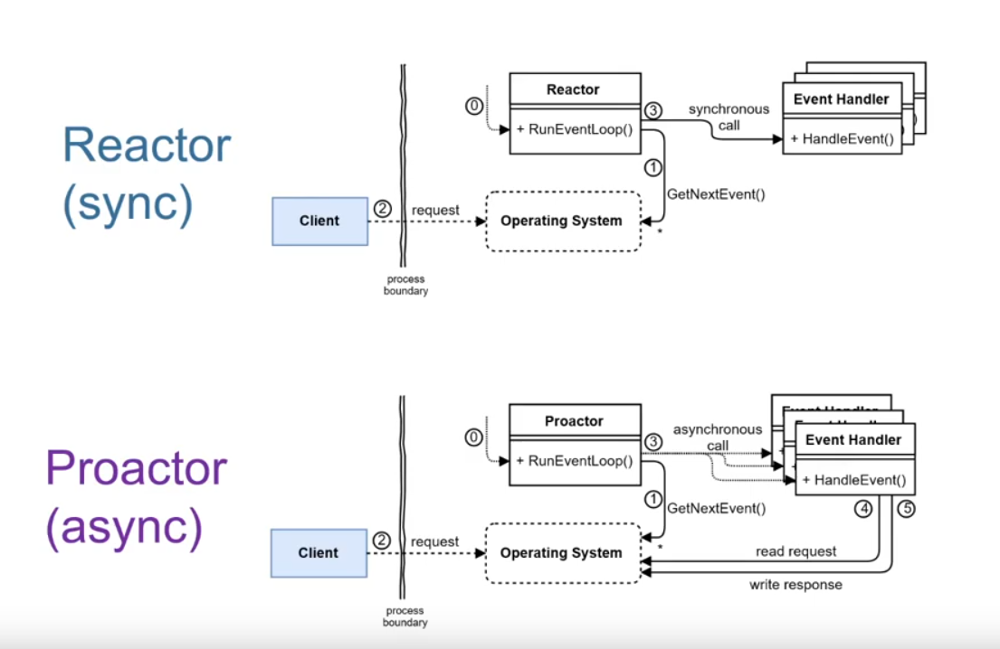

# proactor-pattern

> "Aktionen in einem asynchronen Teil bearbeitet und am Ende des asynchronen Teils wird ein Completion Handler
> aufgerufen."

- See also: [[reactor-pattern]]

## Unterschied reactor pattern

- Bild: <https://youtu.be/Vm5l8zH4hOE>

## Quellen

- <https://de.wikipedia.org/wiki/Proactor>

[//begin]: # "Autogenerated link references for markdown compatibility"
[reactor-pattern]: reactor-pattern.md "reactor-pattern"
[//end]: # "Autogenerated link references"
