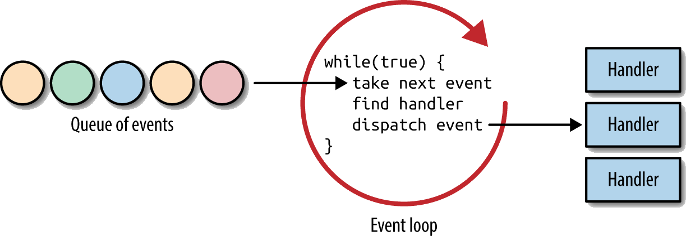

# reactor-pattern

> "For each service the application offers, introduce a sep-arate Event Handler that processes certain types of events.
> All Event Handlers implement the same inter-face. Event Handlers register with an Initiation Dispatcher, which uses a
> Synchronous Event Demultiplexer to wait for events to occur. When events occur, the Synchronous Event Demultiplexer
> notifies the Initiation Dispatcher, which syn-chronously calls back to the Event Handler associated with the event.
> The Event Handler then dispatches the event to the method that implements the requested service" [^paper]

Struktur [^paper]:

1. Handles: Ressourcen des BS
2. Synchronous Event Demultiplexer: Notifies initiation dispatcher when new operation possible
3. Initiation dispatcher: Handles (un)-registering events and calling the respective handlers
4. Event handler: Handle the specific events

- About event handlers: "There is no need to block on I/O, as long as handlers and callbacks for events are registered
  to take care of them. Events refer to instances like a new incoming connection, ready for read, ready for write, etc.
  Those handlers/callbacks may utilize a thread pool in multi-core environments." [^dzone]

## Konzept

1. Annahme und Dispatchen Asynchroner Requests
1. Serialisierte Abarbeitung

## Vorteile

- Belegt wenig Ressourcen auf langsamen Clients
- Kein Kontext wechsel -> Kosten für request kostengünstig

## Nachteile

- Non-Preemptive => kein Blocking I/O in den Event Handlern
- Wenig Isolation
- Schwer zu debuggen

## Beispiele

1. NGINX
2. NodeJS event loop

- <https://stackoverflow.com/questions/56739934/is-nodejs-representing-reactor-or-proactor-design-pattern>
- <https://subscription.packtpub.com/book/web_development/9781783287314/1/ch01lvl1sec09/the-reactor-pattern>

## Quellen

- <https://en.wikipedia.org/wiki/Reactor_pattern>
- <https://stackoverflow.com/questions/5566653/simple-explanation-for-the-reactor-pattern-with-its-applications>
- <https://www.adamtornhill.com/Patterns%20in%20C%205,%20REACTOR.pdf>
- Implementation example: <https://www.grimm-jaud.de/index.php/private-vortraege/30-reactor-pattern>
- Image: <https://images.app.goo.gl/4P9bsWNitpNoiWKRA>
- Nodejs reactor pattern:
  - <https://subscription.packtpub.com/book/web_development/9781785885587/1/ch01lvl1sec10/the-reactor-pattern>
  - <https://blog.logrocket.com/a-complete-guide-to-the-node-js-event-loop/>
  - <https://heynode.com/tutorial/how-event-loop-works-nodejs/>
  - Excellent Presentation: <https://www.youtube.com/watch?v=8aGhZQkoFbQ> and Demo: <http://latentflip.com/loupe/>

[^paper]: <http://www.dre.vanderbilt.edu/~schmidt/PDF/reactor-siemens.pdf>
[^dzone]: https://dzone.com/articles/understanding-reactor-pattern-thread-based-and-eve
