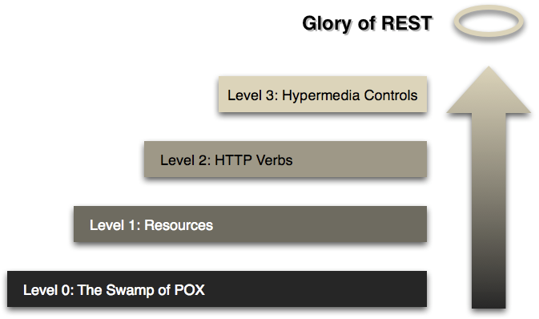

# REST

> Representational state transfer

- Stark an HTTP gebunden, URL adressierbar
- Response Encodings: XML, JSON, HTML, andere denkbar
- Zustandslos, CRUD: `GET, POST, PUT, PATCH, DELETE, HEAD, OPTIONS`
- Chunking:

> "[...] the data stream is divided into a series of non-overlapping "chunks". The chunks are sent out and

received independently of one another. No knowledge of the data stream outside the currently-being-processed chunk is
necessary for both the sender and the receiver at any given time." [^chunk]

- Compression
- Multipart:

> "The multipart mime format is used to pass lists of content bodies. Multiple content bodies are embedded in one
> message. multipart/form-data is often found in web application HTML Form documents and is generally used to upload
> files. The form-data format is the same as other multipart formats, except that each inlined piece of content has a
> name associated with it." [^multip]

Eigenschaften [^restwiki]:

1. Client-Server
1. Zustandslosigkeit
1. Caching
1. Einheitliche Schnittstelle
   - Adressierbarkeit von Ressourcen
   - Repräsentationen zur Veränderung von Ressourcen
   - Selbstbeschreibende Nachrichten
   - „Hypermedia as the Engine of Application State“ (HATEOAS)
1. Mehrschichtige Systeme
1. Code on Demand (optional)

## HATEOAS

> HATEOAS (Hypermedia as the Engine of Application State)

- "REST architectural style lets us use the hypermedia links in the response contents. It allows the client can
  dynamically navigate to the appropriate resources by traversing the hypermedia links." [^hateoas]

[^hateoas]: https://restfulapi.net/hateoas/

## RMM

> "A model (developed by Leonard Richardson) that breaks down the principal elements of a REST approach into three
> steps. These introduce resources, http verbs, and hypermedia controls." [^fowler]

1. Level 0:

> "The starting point for the model is using HTTP as a transport system for remote interactions, but without using any
> of the mechanisms of the web. Essentially what you are doing here is using HTTP as a tunneling mechanism for your own
> remote interaction mechanism, usually based on Remote Procedure Invocation."

2. Level 1:

> "The first step towards the Glory of Rest in the RMM is to introduce resources. So now rather than making all our
> requests to a singular service endpoint, we now start talking to individual resources."

3. Level 2:

> "I've used HTTP POST verbs for all my interactions here in level 0 and 1, but some people use GETs instead or in
> addition. At these levels it doesn't make much difference, they are both being used as tunneling mechanisms allowing
> you to tunnel your interactions through HTTP. Level 2 moves away from this, using the HTTP verbs as closely as
> possible to how they are used in HTTP itself."

4. Level 3:

> "The final level introduces something that you often hear referred to under the ugly acronym of HATEOAS (Hypertext As
> The Engine Of Application State). It addresses the question of how to get from a list open slots to knowing what to do
> to book an appointment."

...

> "The point of hypermedia controls is that they tell us what we can do next, and the URI of the resource we need to
> manipulate to do it. Rather than us having to know where to post our appointment request, the hypermedia controls in
> the response tell us how to do it."

Advantages of hypermedia controls:

- "One obvious benefit of hypermedia controls is that it allows the server to change its URI scheme without breaking
  clients"
- "A further benefit is that it helps client developers explore the protocol."

[^fowler]: https://martinfowler.com/articles/richardsonMaturityModel.html

---

- See: <https://restfulapi.net/>

[^restwiki]: https://de.wikipedia.org/wiki/Representational_State_Transfer
[^chunk]: https://en.wikipedia.org/wiki/Chunked_transfer_encoding
[^multip]: https://quarkus.io/guides/rest-client-multipart
