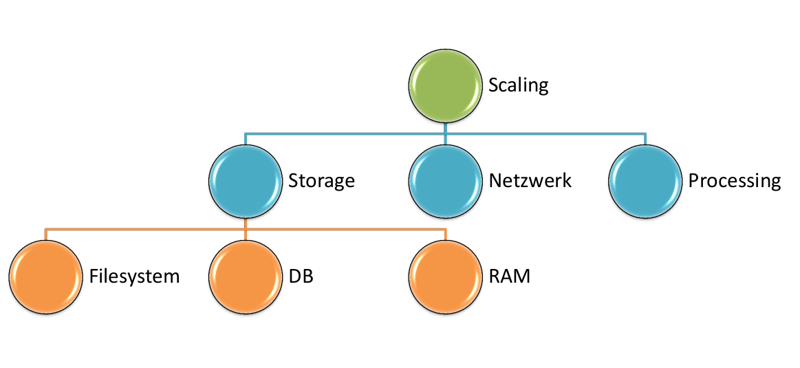

# scaling

Am Beispiel von Datenbankskalierung: [[db-scaling]].

[//begin]: # "Autogenerated link references for markdown compatibility"
[db-scaling]: db-scaling.md "db-scaling"
[//end]: # "Autogenerated link references"
