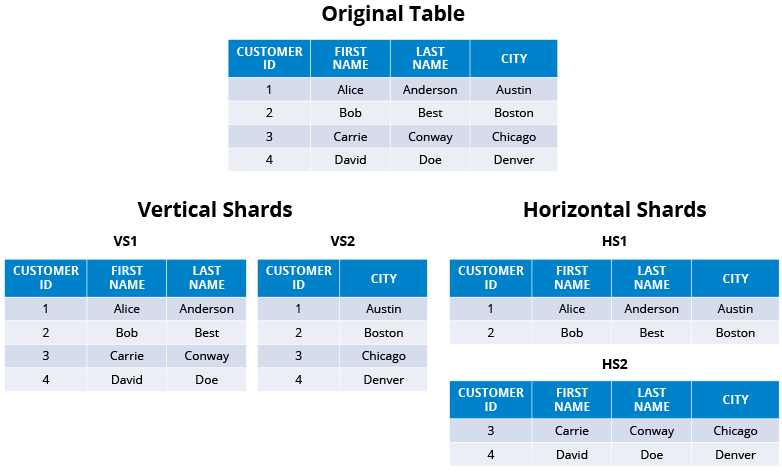

# sharding

> Reihen oder Spalten einer großen Datenbank in kleinere Tabellen aufteilen

1. Horizontal Sharding: Reihen werden aufgeteilt(Teilmenge der Daten)
2. Vertikales Sharding: Spalten werden aufgeteilt(Teilmenge des Datenschemas)

- <https://hazelcast.com/glossary/sharding/>

## Difference sharding [[consistent-hashing]]

> "You can think of sharding as the decision to put your data on multiple machines, and consistent hashing as one of
> many methods of determining which machine any particular piece of data goes to." [^shard]

1. Sharding is the act of taking a data set and splitting it across multiple machines. When you shard you say you’re
   moving data around, but you haven’t yet answered the question of which machine takes what subset of data.
2. Consistent hashing is an algorithm for assigning a set of keys to machines

---

- Man kann sharding ohne consistent hashing nutzen
- Reines consistent hashing kann auch Vorteile haben

## Pro/Con sharding

| Pro                        | Con                                          |
| -------------------------- | -------------------------------------------- |
| Very good scaling          | Merging and splitting can get complicated    |
| Avoids over usage          | It has to be taken care on application level |
| Improves partion tolerance | Shards are complicated                       |

- Source:
  - <https://www.quora.com/What-advantages-and-disadvantages-does-database-sharding-have>
  - <https://medium.com/system-design-blog/database-sharding-69f3f4bd96db>

[//begin]: # "Autogenerated link references for markdown compatibility"
[consistent-hashing]: consistent-hashing.md "consistent-hashing"
[//end]: # "Autogenerated link references"

[^shard]: https://www.quora.com/What-is-the-difference-between-consistent-hashing-and-sharding-in-a-distributed-system
