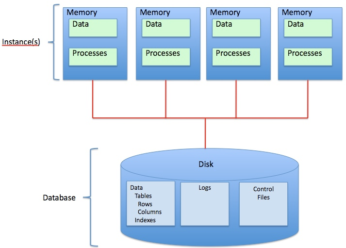

# shared-disk-architecture

> "Shared Disk Architecture is an architecture which is used in distributed computing in which the nodes share same disk
> devices but each node has its own private memory. The disks have active nodes which share memory in case of any
> failures. In this architecture the disks are accessible from all the cluster nodes. This architecture has quick
> adaptability to the changing workloads. It uses robust optimization techniques." [^sn]

1. **Pro:**
   - Adaptiert schnell bei unterschiedlichen Last Szenarien (dynamisches Loadbalancing)
   - Failover / HA ist einfach
2. **Con:**
   - Schlecht bei hoher Schreibe Last (dirty Caches in den Knoten)
   - Preis der Skalierung abhängig von der eingesetzten Technologie

- See also: [[sharding]]

## Sources

- Images: <https://upload.wikimedia.org/wikipedia/commons/0/07/Shared_Disk_Architecture.jpg>

[^sn]: https://www.geeksforgeeks.org/difference-between-shared-nothing-architecture-and-shared-disk-architecture/
