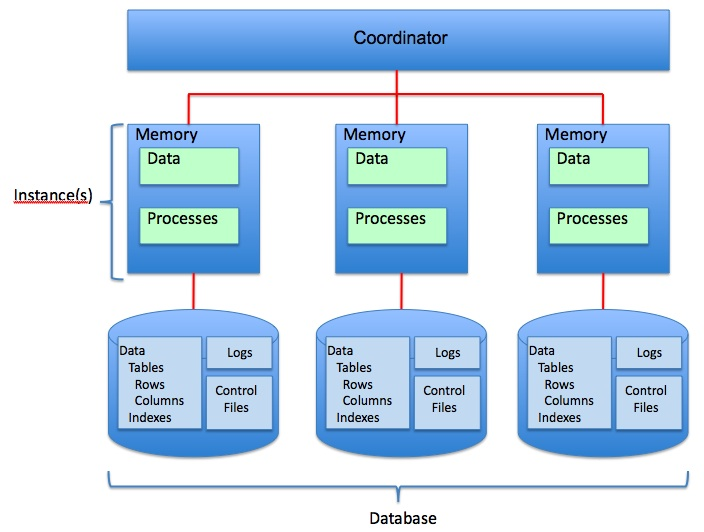

# shared-nothing

> "Shared nothing architecture is an architecture which is used in distributed computing in which each node is
> independent and different nodes are interconnected by a network. Every node is made of a processor, main memory and
> disk. The main motive of this architecture is to remove the contention among nodes. Here the Nodes do not share memory
> or storage. The disks have individual nodes which cannot be shared. It works effectively on high volume and read write
> environment." [^sn]

- Daten sind partitioniert (Sharding) und lokal zum verarbeitenden Knoten
- (unendlich) skalierbar

1. **Pro:**
   - Gut bei hoher Lese/Schreibe Last
2. **Con:**
   - Schlecht bei Transaktionen über das Cluster
   - Schlecht bei Datenverknüpfungen
   - Weitere Kapazität Ausbau „teuer“
   - HA nur beschränkt möglich
   - Schwer zu „balancen“

## Sources

- Image: <https://tideways.com/wp-content/uploads/import/blog/shared-nothing-architecture.png>

[^sn]: https://www.geeksforgeeks.org/difference-between-shared-nothing-architecture-and-shared-disk-architecture/
