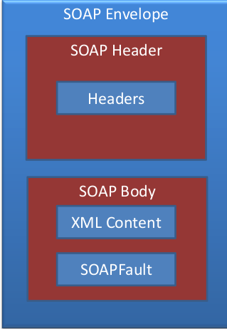

# SOAP

> "Netzwerkprotokoll, mit dessen Hilfe Daten zwischen Systemen ausgetauscht und Remote Procedure Calls durchgeführt
> werden können." [^soapwiki]

Eigenschaften:

- XML basiert
- HTTP typisch als Transport, aber nicht erforderlich
- WSDL als Beschreibungssprache

## Nachrichtenstruktur

> Struktur: Envelope, Header, Body

[^soapwiki]: https://de.wikipedia.org/wiki/SOAP
