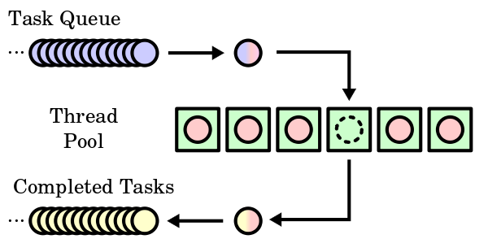

# thread-pooling-pattern

> "maintains multiple threads waiting for tasks to be allocated for concurrent execution by the supervising program"

- Increase performance and reduce latency in execution by maintaining a pool of threads
- Number of thread related to resources available to the programm
  - As reference, latency is: "the delay before a transfer of data begins following an instruction for its transfer."

1. Vorteile:

- Optimiert Zyklus
- Systemunabhängige programmierung aber systemabhängige Konfiguration
- Isolation

2. Nachteile

- (Speicher) Overhead
- Synchronisation der Queues

## Sources

- <https://en.wikipedia.org/wiki/Thread_pool>
- <https://en.wikipedia.org/wiki/Latency_(engineering)>
