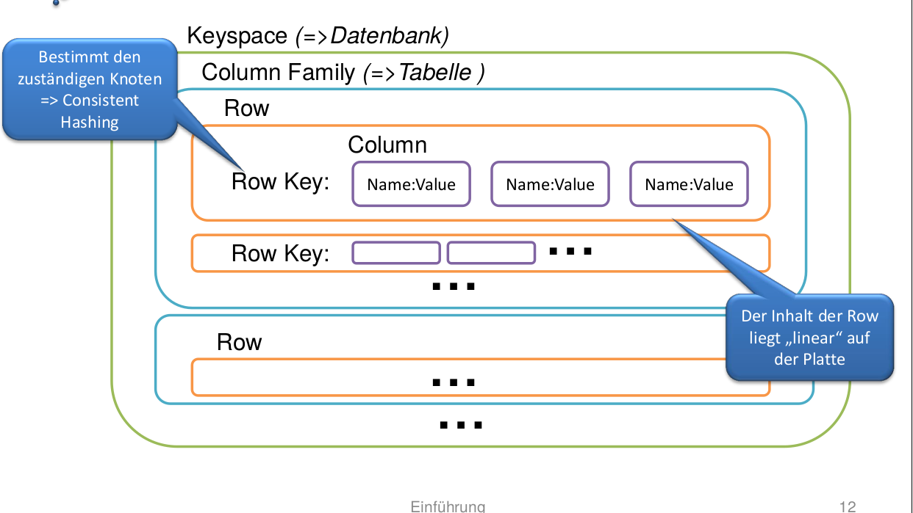

# tuneable-consistency

Eigenschaften:

- Zwischen starker und _eventual consistency_ wählen
- Per Operation und für lesen und schreiben möglich
- Managed Multi-Datenzentren use-cases operationen

## Funktionsweise

- Replikationsfaktor wird festgelegt
- Quorum = GanzZahligAbgerundet(Replikationsfaktor / 2 + 1)
- Verschiedene Konsistenzlevel (pro Operation wählbar)
- Konflikt Auflösung via Timestamp - neuster gewinnt

### Konsistenzlevel

#### Lesend (Auswahl)

1. ONE: Antwort des nächsten Knotens
1. Quorum: Antwort mit aktuellstem Zeitstempel aus Quorum Knoten
1. Local Quorum: wie Quorum aber nur aus einem Rechenzentrum
1. ALL: Antwort mit aktuellstem Zeitstempel nach Abfrage aller Replika- Knoten

#### Schreibend (Auswahl)

1. Any: Der Schreibzugriff muss persistiert sein (eventuell Lesen nicht möglich wenn die zuständigen Knoten nicht
   verfügbar => [[hinted-handoff]])
1. ONE: Der Schreibzugriff muss einem zuständigen Knoten persistiert sein (ist danach lesbar)
1. Quorum: der Schreibzugriff muss bei Quorum Knoten erfolgreich sein
1. Local Quorum: wie Quorum nur 1 RZ
1. All: der Schreibzugriff muss bei allen Replika-Knoten erfolgreich sein

## Datenmodell



Beispiel Queries:

```sql
SELECT name FROM students
USING CONSISTENCY QUORUM
where id = 10
```

---

- See: <https://www.youtube.com/watch?v=hKLKpqY9UrY>
- Related: CAP-Theorem aka. [[brewers-theorem]]

[//begin]: # "Autogenerated link references for markdown compatibility"
[hinted-handoff]: hinted-handoff.md "hinted-handoff"
[brewers-theorem]: brewers-theorem.md "brewers-theorem"
[//end]: # "Autogenerated link references"
